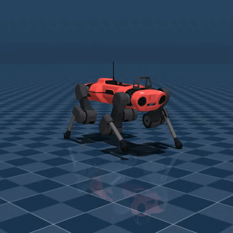
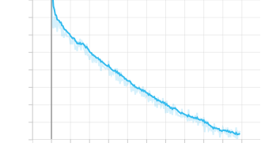
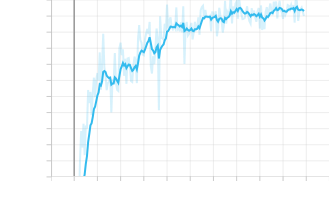
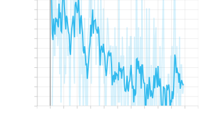
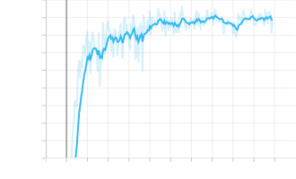

# differential-policies

[](https://www.python.org/)
[](https://github.com/google/jax)
[](https://github.com/google-deepmind/mujoco)

a JAX/MJX reference implementation of [Learning Deployable Locomotion Control via Differentiable Simulation](https://arxiv.org/abs/2404.02887) (Schwarke et al., CoRL 2025).

the original paper uses Warp. this reimplements the core idea in MuJoCo MJX.



---

## the paper in one paragraph

Schwarke et al. train locomotion policies by backpropagating gradients directly through the simulator (SHAC — short-horizon actor-critic). the blocker is that contact solvers use hard complementarity conditions, killing gradients at every foot contact. their fix: replace the hard switch with a sigmoid. this produces smooth, usable gradients and enables direct policy optimization without PPO or reward engineering tricks.

---

## this implementation

the original uses Warp as the differentiable backend. here we use MuJoCo MJX (pure JAX), which makes the whole pipeline, environment, policy, training, a single JAX program.

the contact smoothing patch is a monkey-patch on MJX's `constraint.py`, applied at import time:

```python
active = pos < 0              # original — hard switch, gradient dies at contact
active = sigmoid(-pos * κ)   # patched  — smooth activation, κ = 300
```

three sites are patched: frictionless, pyramidal, and elliptic friction cones.

---

## results

training curves (v9, 20k iterations, 512 envs, single GPU):

<table align="center">
  <tr>
    <td align="center"><br><sub>policy loss</sub></td>
    <td align="center"><br><sub>linear velocity tracking reward</sub></td>
  </tr>
  <tr>
    <td align="center"><br><sub>fraction of NaN gradients</sub></td>
    <td align="center"><br><sub>angular velocity tracking reward</sub></td>
  </tr>
</table>

`lin_vel_tracking` peaks at **0.73** (0 = standing still, 1 = perfect velocity tracking). trains in ~2h on an RTX 3090.

these results are a starting point, not a ceiling. the reward weights were not heavily tuned and training was capped at 20k iterations. longer runs, a learning rate schedule sweep, or tighter reward scaling would likely push tracking performance higher — the policy loss curve is still improving at convergence, which suggests there is headroom left.

one difference from the paper: MJX's smoothed gradients have a cosine similarity of **0.374** vs finite differences, compared to Warp's presumably higher quality. this means we need 32-step unrolls where the paper uses 12 — longer unrolls compensate for noisier gradient direction.

---

## setup

```bash
git clone https://github.com/yourusername/differential-policies
cd differential-policies
uv sync
```

requires a CUDA-capable GPU. JAX with CUDA 13 is pulled in automatically.

---

## training

open `anymal.ipynb`. hyperparameters are in the third cell:

| param | value | notes |
|---|---|---|
| `unroll_length` | 32 | covers ~1.3 trot cycles |
| `num_envs` | 512 | |
| `num_training_steps` | 20 000 | |
| `kappa` | 300 | contact smoothing sharpness |

---

## evaluation

```bash
# passive viewer
uv run eval_viewer.py saved_policies/schwarke_stage1_v9.pkl

# interactive — gamepad required (left stick = move, right stick = rotate)
uv run drive.py saved_policies/schwarke_stage1_v9.pkl
```

---

## repo structure

```
envs/
  register_ahac_anymal.py     — ANYmal environment, rewards, PD control
  assets/anybotics_anymal_c/  — MuJoCo XML and meshes
shac/
  train.py                    — SHAC trainer
  losses.py                   — policy and critic losses
  networks.py                 — MLP policy and value networks
smooth_mjx/
  __init__.py                 — contact smoothing patch (the key piece)
eval_viewer.py                — passive viewer
drive.py                      — gamepad controller
anymal.ipynb                  — training notebook
```

---

## acknowledgments

- [Schwarke et al., CoRL 2025](https://arxiv.org/abs/2404.02887) — the paper this implements
- [Andrew-Luo1/jax_shac](https://github.com/Andrew-Luo1/jax_shac) — starting point for the SHAC implementation
- [Brax](https://github.com/google/brax) — batched MJX environment wrappers
